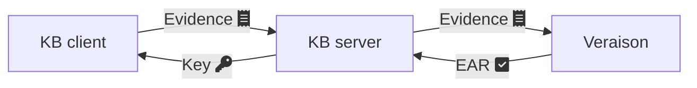

# Key Broker demo

A simple key broker protocol with client and server components implemented in Rust.

Client and server are respectively [RATS](https://www.rfc-editor.org/rfc/rfc9334.html#figure-1) attester and relying party.

[Veraison](https://github.com/veraison/services) is used as the verifier.

