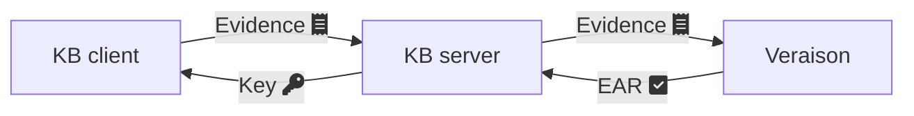

# Key Broker demo

A simple key broker protocol with client and server components implemented in Rust.

Client and server are respectively [RATS](https://www.rfc-editor.org/rfc/rfc9334.html#figure-1) attester and relying party.

[Veraison](https://github.com/veraison/services) is used as the verifier.



## Building

The `keybroker-demo` has 2 executables: `keybroker-server` and `keybroker-app`.
These are built with:

```console
$ cd rust-keybroker
$ cargo build
```

By default, the executables are in debug mode and located in directory
`target/debug/`.

## Running

The `keybroker-server` and `keybroker-app` can be controlled with command line
options. Use `-h` / `--help` to get their usage, e.g.:

```
$ target/debug/keybroker-server --help
A simple web service that can provide keys and secrets in exchange for verifiable attestation tokens.

Usage: keybroker-server [OPTIONS]

Options:
  -a, --addr <ADDR>
          The interface on which this server will listen (use 0.0.0.0 to listen on all interfaces) [default: 127.0.0.1]
  -p, --port <PORT>
          The port on which this server will listen [default: 8088]
  -e, --endpoint <ENDPOINT>
          The address at which this server can be reached to request a key or submit an evidence. It will be set by default to 'http://{addr}', but this value can be overridden with an FQDN for {addr} in order to use name resolution for example. The port number will be appended, so don't leave a trailing '/' to the FQDN
      --verifier <VERIFIER>
          The URL where the verifier can be reached [default: http://veraison.test.linaro.org:8080]
  -m, --mock-challenge
          Use the static CCA example token nonce instead of a randomly generated one
  -v, --verbosity...
          Increase verbosity
  -q, --quiet
          Silence all output
      --reference-values <REFERENCE_VALUES>
          File containing a JSON array with base64-encoded known-good RIM values [default: reference-values.json]
  -h, --help
          Print help
  -V, --version
          Print version
```

The simplest way to get started with `keybroker-server` and `keybroker-app` is
to run them locally in _mocking_ mode (i.e they make use of statically known
values).

In a terminal, start `keybroker-server` with:

```console
$ target/debug/keybroker-server -v -m --reference-values ../testdata/rims-matching.json
INFO starting 11 workers
INFO Actix runtime found; starting in Actix runtime
INFO starting service: "actix-web-service-127.0.0.1:8088", workers: 11, listening on: 127.0.0.1:8088
```

In another terminal, launch `keybroker-app` with:

```console
$ target/debug/keybroker-app -v -m skywalker
INFO Requesting key named 'skywalker' from the keybroker server with URL http://127.0.0.1:8088/keys/v1/key/skywalker
INFO Submitting evidence to URL http://127.0.0.1:8088/keys/v1/evidence/1923965078
INFO Attestation success :-) ! The key returned from the keybroker is 'May the force be with you.'
```

`keybroker-app` is requesting the key named `skywalker` from `keybroker-server`.
As we are in _mocking_ mode with statically known challenges and evidences, the
attestation succeeds: `keyboker-app` receives the key `May the force be with
you.` from `keybroker-server`.

## Logging

`keybroker-server` and `keybroker-app` use Rust's `log` and `stderrlog` crates
for logging. the verbosity can be controlled from the command line with the `-q`
/ `--quiet` (to silence all messages) and `-v` / `--verbose` switches. Note the
`-v` / `--verbose` can be specified multiple times to increase verbosity.

The mapping that has been implemented in `keybroker-server` and `keybroker-app` is:

| Log level | Verbosity threshold | `keybroker-*`                                            |
| --------- | ------------------- | -------------------------------------------------------- |
| Error     |          0          | Enabled by default, unless invoked with `-q` / `--quiet` |
| Warning   |	       1          | Enabled by default, unless invoked with `-q` / `--quiet` |
| Info 	    |          2          | Enabled with `-v` or `--verbose`                         |
| Debug     |          3          | Enabled with `-vv` or `-v -v` or `--verbose --verbose`   |
| Trace     |          4          | Enabled with `-vvv` or `-v -v -v` or ...                 |